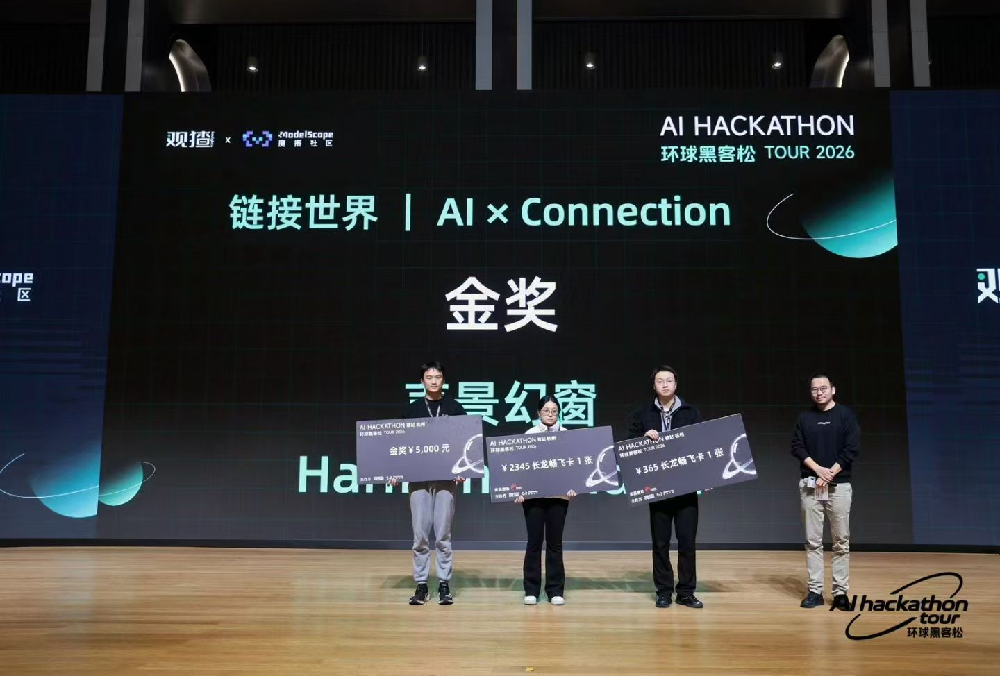
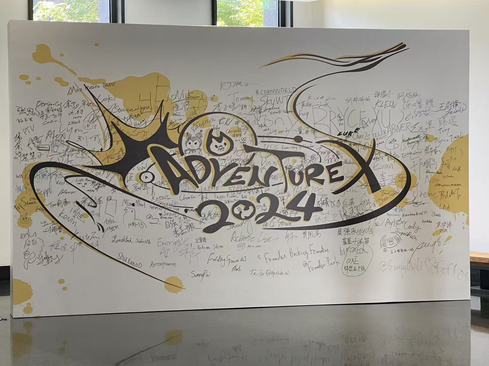

# Yui / 悠一

我是 Yui（邬健翔 / WU JIANXIANG），目前在日本**福井大学**读研究生，同时在 **AI Mage**（アニメ IP × AI 的东京初创公司）实习。

我是一名 **AI Native Developer**、独立软件开发者、设计师和创作者。我的关注点不是把 AI 当成附加功能，而是围绕 AI 能力设计产品：从需求拆解、工作流编排、Agent 系统、RAG / GraphRAG，到用户体验和最终验证。

- 🌐 个人网站：[aaccx.pw](https://aaccx.pw)
- 🤖 把这个链接发给你的 AI Agent，它就能了解我：[aaccx.pw/SKILL.md](https://aaccx.pw/SKILL.md)
- 📧 邮箱：<xiaobianfuai@gmail.com>

## 关注方向

- AI Native 产品
- Coding Agent 工作流
- Agentic RAG / GraphRAG
- LangChain / LangGraph
- 多模态 API 与提示词工作流
- 简洁、直观、好用的数字产品

## 技术与工具

- 开发：Python、React、TypeScript、HTML / CSS、Flutter、微信小程序、Android
- AI 系统：RAG、Agentic RAG、GraphRAG、LangChain、LangGraph、向量检索
- 工作流：Dify、n8n、Coze、LangGraph
- 工具：Figma、VS Code、Cursor、Trae、Codex、Windsurf

## 经历

- **AI Mage** — 实习（アニメ IP 监修 × AI）· 2026.8 – 2026.9
- **National Energy Research Institute** — 研发 / 运维实习 · 2025.9 – 2026.3
  围绕多模态 RAG 做开发、部署与运维：抽取文档中的文本 / 图像 / 表格，用本地视觉模型打标、Embedding 向量化与召回测试，并用 Docker 搭建多模态 Agentic RAG 对话 WebUI（前后端一体）。

## 教育

- **福井大学** 大学院工学研究科 · 知識社会基礎工学専攻（情報工学）· 2026.4 – 2028.3

## 语言与证书

- JLPT N2 · TOEIC 850 · TOEFL iBT 84

## 黑客松与获奖

  
  

- 🥇 环球黑客松（Global AI Hackathon Tour）金奖 · 2026
- 🎖️ 南京大学 AI 黑客松高校巡回赛 决赛入围 · 2026
- 🥈 TRAE SOLO Hackathon 二等奖 · 2025
- 🥇 渝客松 Google GDG 赛道 第一名 · 2025（项目 [YUIkesong](https://github.com/cnYui/YUIkesong)）
- 🥉 无锡 Rokid AR AI 智能眼镜开发 三等奖 · 2025
- 🏅 腾讯云黑客松 获奖 · 2025

## 经历关键词

- 福井大学研究生
- AI Mage 实习（アニメ IP 监修 × AI）
- AI Native Developer
- 高频黑客松参与者
- 产品导向的 AI Coding 实践者
- 关注设计审美、产品完整性与验证闭环
